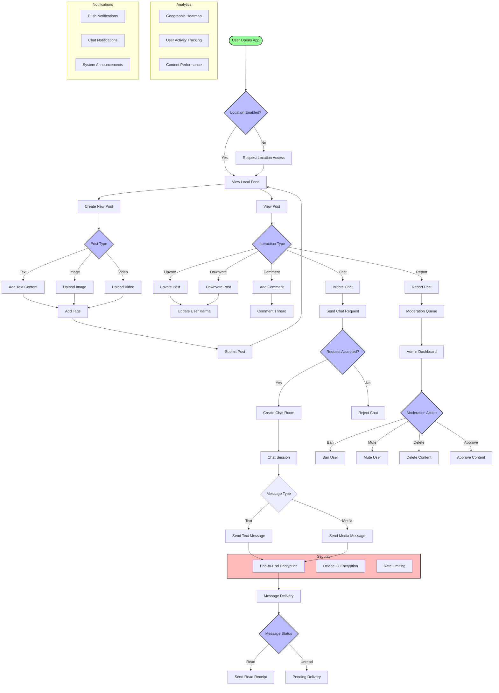

```mermaid
graph TD
    %% Main User Flows
    Start([User Opens App]) --> LocationCheck{Location Enabled?}
    LocationCheck -->|No| RequestLocation[Request Location Access]
    LocationCheck -->|Yes| MainFeed[View Local Feed]
    RequestLocation --> MainFeed

    %% Post Creation Flow
    MainFeed --> CreatePost[Create New Post]
    CreatePost --> PostType{Post Type}
    PostType -->|Text| TextPost[Add Text Content]
    PostType -->|Image| ImagePost[Upload Image]
    PostType -->|Video| VideoPost[Upload Video]
    TextPost --> AddTags[Add Tags]
    ImagePost --> AddTags
    VideoPost --> AddTags
    AddTags --> SubmitPost[Submit Post]
    SubmitPost --> MainFeed

    %% Post Interaction Flow
    MainFeed --> ViewPost[View Post]
    ViewPost --> Interaction{Interaction Type}
    Interaction -->|Upvote| Upvote[Upvote Post]
    Interaction -->|Downvote| Downvote[Downvote Post]
    Interaction -->|Comment| AddComment[Add Comment]
    Interaction -->|Report| ReportPost[Report Post]
    Interaction -->|Chat| InitiateChat[Initiate Chat]
    Upvote --> UpdateKarma[Update User Karma]
    Downvote --> UpdateKarma
    AddComment --> CommentThread[Comment Thread]
    ReportPost --> ModerationQueue[Moderation Queue]

    %% Chat System Flow
    InitiateChat --> ChatRequest[Send Chat Request]
    ChatRequest --> RequestResponse{Request Accepted?}
    RequestResponse -->|Yes| CreateChatRoom[Create Chat Room]
    RequestResponse -->|No| RejectChat[Reject Chat]
    CreateChatRoom --> ChatSession[Chat Session]
    ChatSession --> MessageType{Message Type}
    MessageType -->|Text| SendText[Send Text Message]
    MessageType -->|Media| SendMedia[Send Media Message]
    SendText --> E2EEncrypt[End-to-End Encryption]
    SendMedia --> E2EEncrypt
    E2EEncrypt --> MessageDelivery[Message Delivery]
    MessageDelivery --> MessageStatus{Message Status}
    MessageStatus -->|Read| ReadReceipt[Send Read Receipt]
    MessageStatus -->|Unread| PendingDelivery[Pending Delivery]

    %% Admin Flow
    ModerationQueue --> AdminDashboard[Admin Dashboard]
    AdminDashboard --> ModAction{Moderation Action}
    ModAction -->|Ban| BanUser[Ban User]
    ModAction -->|Mute| MuteUser[Mute User]
    ModAction -->|Delete| DeleteContent[Delete Content]
    ModAction -->|Approve| ApproveContent[Approve Content]

    %% System Features
    subgraph Security
        E2EEncrypt
        DeviceID[Device ID Encryption]
        RateLimit[Rate Limiting]
    end

    subgraph Analytics
        HeatMap[Geographic Heatmap]
        UserActivity[User Activity Tracking]
        ContentMetrics[Content Performance]
    end

    subgraph Notifications
        PushNotif[Push Notifications]
        ChatNotif[Chat Notifications]
        SystemNotif[System Announcements]
    end

    %% Styling
    classDef process fill:#f9f,stroke:#333,stroke-width:2px;
    classDef decision fill:#bbf,stroke:#333,stroke-width:2px;
    classDef start fill:#9f9,stroke:#333,stroke-width:2px;
    classDef security fill:#fbb,stroke:#333,stroke-width:2px;
    
    class Start start;
    class LocationCheck,PostType,Interaction,RequestResponse,MessageStatus,ModAction decision;
    class Security security;
``` 